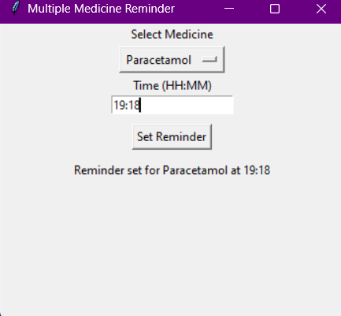

# 💊 MedBot: Python-Based Medicine Reminder App

A simple and effective medicine reminder app built with **Python** that alerts users with a voice notification when it's time to take their medicine. This app supports **multiple reminders**, uses a **dropdown for medicine selection**, and **saves reminders to a file** so they persist even after restarting.

---

## 🛠️ Features

- ✅ Set reminders for multiple medicines
- ⏰ Input reminder time in 24-hour format (HH:MM)
- 🔊 Voice alert using `pyttsx3`
- 💾 Reminders are saved in a CSV file
- 🔁 Recurring daily reminders
- 🧭 User-friendly GUI using `tkinter`
- 📋 Dropdown menu for common medicines

---

## 📸 Screenshots



---

## 🚀 Getting Started

### 🔧 Prerequisites

- Python 3.x
- The following Python libraries:
  ```bash
  pip install pyttsx3
  ```

### ▶️ How to Run

1. Clone this repository:

   ```bash
   git clone https://github.com/YOUR_USERNAME/medbot-medicine-reminder.git
   cd medbot-medicine-reminder
   ```

2. Run the script:
   ```bash
   python med_reminder.py
   ```

---

## 🧠 Technologies Used

- Python 🐍
- Tkinter (GUI)
- pyttsx3 (Text-to-Speech)

---

## 📁 File Structure

```
medbot-medicine-reminder/
├── med_reminder.py
├── reminders.csv
└── README.md
```

---

## 📌 To-Do (Optional Improvements)

- [ ] Add option to delete/edit reminders
- [ ] Daily history log
- [ ] Convert app to standalone `.exe` using PyInstaller
- [ ] Mobile app version using Kivy

---

## 👩‍💻 Author

**Sakshi [Sakshi Raut]**  
📧 [sakshiraut1251018@gmail.com]  
🔗 [https://github.com/sakshir10/medbot-medicine-reminder]

---

## 📄 License

This project is licensed under the [MIT License](LICENSE).
